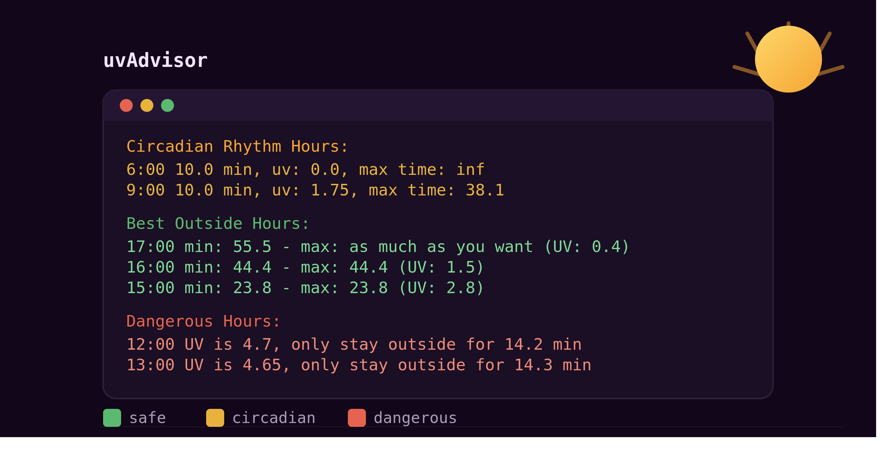

# uvAdvisor

#### Video Demo:https://www.youtube.com/watch?v=UQMLDKvZx5I

#### Description:

Sun exposure advice is usually one size fits all: "wear sunscreen," "get morning light." It doesn't account for skin type, location, or what you're actually trying to do, build a tan without burning, or just get circadian daylight without tanning at all. uvAdvisor answers that question directly: given your skin type, your location, and your goal, how long can you safely be outside, right now or at any hour today.

uvAdvisor is a command line tool written in Python. You give it your skin type, your goal, and your city, and it tells you exactly which hours of the day are safe, which are dangerous, and how long you can stay out in each window.

I used Claude to help me hone this documentation, which resulted in smoother and more descriptive finalized document,

### Table of Contents

- [What it does](#what-it-does)
- [How to run it](#how-to-run-it)
- [Design choices](#design-choices)
- [Files](#files)
- [AI use documented](#ai-use-documented)
- [Data and disclaimer](#data-and-disclaimer)
- [Known limitations](#known-limitations)

## What it does

You give it your skin type, your goal (tan or avoid tanning), and your city. It fetches live UV and weather data for your location from Open-Meteo and tells you, kfor any hour of the day:

- the minimum time outside you need to hit your circadian rhythm and vitamin D targets
- the maximum time you can stay out before you'd burn or tan past your goal
- which hours are flat out dangerous for your skin type
- which hours produce effectively no tan/burn at all, if you just want daylight with zero risk

It runs in three modes:

| mode            | what it shows                             | when to use it                           |
| --------------- | ------------------------------------------ | ----------------------------------------- |
| 1, current      | min/max safe time right now               | quick check before you walk out the door |
| 2, hourly       | full ranked breakdown of every hour today | planning your day                        |
| 3, specific day | same as mode 2, for a date you choose     | planning ahead                           |

after the mode 2 and 3 you're asked if you want to save the output in the form of a pdf file or not

## How to run it

```
python3 -m venv uvAdvisor
source uvAdvisor/bin/activate 
pip install requests fpdf2
python main.py 
```
It'll walk you through picking a skin type (with an actual color swatch printed in the terminal so you can match it visually instead of guessing a Fitzpatrick number), your goal, your city, and your mode.

```
python main.py default current
python main.py default hourly
python main.py default
python main.py
```
You can change what default should mean in the main.py code, line 235

This skips all prompts, defaults to medium skin type and "avoid" goal, and auto detects your city from your IP.

If you want to change the default values, edit [config.json](config.json). The script reads it automatically when it starts.

Example:

```json
{
	"default_skin_type": "MEDIUM",
	"default_goal": "avoid",
	"default_sub_mode": "hourly"
}
```

## Design choices

**Why `InfoPoint` is a class and not a dict.** Every hour's weather data needs the same derived field: what part of the day it falls in (morning, afternoon, evening, night), which depends on parsing the hour out of the API's timestamp. Doing that parse once in `__init__` instead of recomputing "is this morning" inline every time it's needed keeps `helpers.py` from repeating the same hour math in five different places. One object, one source of truth per data point.

**Why `SkinType` is an enum instead of a string or a raw number.** A raw int (`skin_type = 3`) means every function that takes skin type either trusts the caller to pass something in range, or has to validate it. The enum makes "MEDIUM" the actual value passed around, not "3 if you remember it means MEDIUM," and input validation becomes a one line check at the boundary instead of validation logic scattered through `helpers.py`.

**Why the exposure formula treats "avoid" and "tan" as genuinely different calculations,** not the same formula with a flipped sign. Avoiding a tan still requires a minimum exposure (you need circadian/vitamin D light), it's a min/max band capped low. Tanning needs a higher minimum (enough UV to actually trigger melanin) and a tighter max (burn line is closer). They share the same skin multiplier table but the constants and bounds genuinely differ, so `get_exposure()` branches on goal rather than trying to force one formula to cover both.

**Why ranking happens in `helpers.py`, not `main.py`.** `main.py`'s job is fetching data and printing it. `get_best_intervals()` owns the actual decision logic: which hours are dangerous, which are wasted (no tan/burn happening either way), which are worth ranking by UV. Keeping that in `helpers.py` means mode 2 and mode 3 call the exact same ranking function instead of each reimplementing it, which is also why they're identical except for which date they fetch.

## Files

- `` , entry point. Handles user input, request get requests for geocoding and weather, and the three modes.
- `helpers.py` , all the calculation and ranking logic, plus the UI helper that prints a skin color swatch in the terminal.
- `InfoPoint.py` , a class wrapping a single hour's forecast data (time, UV, weather code, temperature) and deriving its time of day.
- `skin_type.py` , a `SkinType` enum for the six Fitzpatrick skin types this tool supports.

## AI use documented

Per CS50's policy, here's where and how AI was used in this project, and what each tool actually did.

| where                                                                                                                                                             | tool           | what i asked for                                                                                                                                                   | what it did                                                                             |
| ----------------------------------------------------------------------------------------------------------------------------------------------------------------- | -------------- | ------------------------------------------------------------------------------------------------------------------------------------------------------------------ | --------------------------------------------------------------------------------------- |
| `helpers.py`, `color_block()`                                                                                                                                     | Claude         | gave it a spec: print an actual color block in the terminal for a given rgb tuple, using ansi escape codes                                                         | wrote the function whole                                                                |
| `helpers.py`, `skin_multiplier`, `dangerous_uv` constants, and the formulas inside `get_exposure()`, `get_vitaminD_exposure()`, `get_circadian_rhythm_exposure()` | Gemini         | asked for real starting values and formulas for sun exposure time, since i'm not a dermatologist and didn't want to guess numbers                                  | gave me the constants and formula shapes used in those functions.                       |
| ``, `mode3()`                                                                                                                                              | GitHub Copilot | nothing explicit, it autocompleted while i was typing                                                                                                              | suggested most of the function based on the pattern from `mode2()`, which i wrote first |
| ``, requests/API calls throughout the file                                                                                                                 | Claude         | asked how to structure the requests calls (building query params into a url, calling `.json()` on the response, chaining the geocoding call into the weather call) | explained the pattern, which i then applied across the file                             |
| `main.py`, skin type input parsing (the block that accepts either a name like "MEDIUM" or a number like "3")                                                      | Claude         | asked for a fix so the input accepts both the skin type name and its numeric value, since the printed menu shows both                                              | wrote that block                                                                        |
| main.py the pdf generation layout                                                                                                                                 | Copilot        | autocompleted the tables after the circadian rhythm one                                                                                                            | autocompleted/i debugged and adjusted to size                                           |

## Data and disclaimer

UV index, weather code, and temperature all come from [Open-Meteo](https://open-meteo.com/) (CC BY 4.0), no API key required. The skin multiplier table is adapted from public consumer sun calculators, not a clinical source.
This is a wellness estimate, not medical advice: individual sensitivity varies, and no UV exposure is fully risk free.

## Known limitations
- No persistence. Every run starts from scratch; nothing about your skin type or location is saved between sessions.
- City lookup takes the first geocoding match Open-Meteo returns, which can be wrong for cities that share a name across countries.
- The skin multiplier table is a fixed starting point, not personally calibrated to the individual user.
